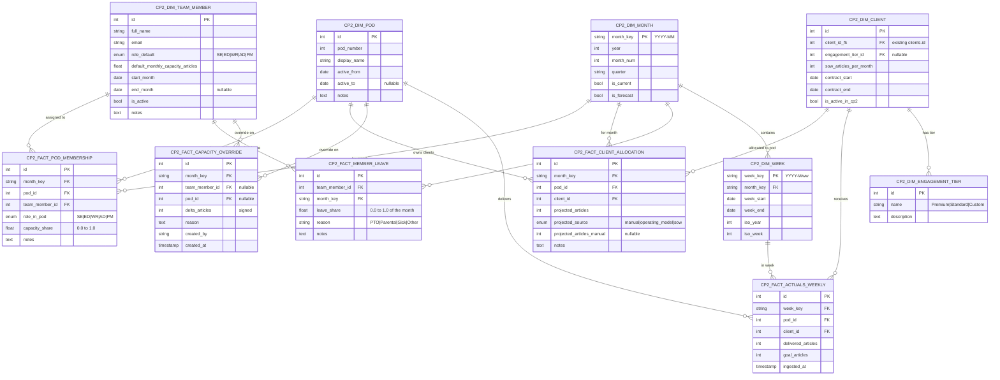

# Capacity Planning v2 — Proposal

> **Status (2026-04-18):** UI prototype of **Phases 1–8 is shipped** to production
> under `/capacity-planning`, backed by `localStorage` + mock data. **Zero `cp2_*`
> tables exist in the database.** The spec below is still the canonical plan; the
> "Status" section at the bottom tracks what's built vs outstanding and includes
> the dashboard-migration sequence.
>
> Production alias: `editorial-hub-kappa.vercel.app/capacity-planning`.
> Source of truth for what's actually built: `frontend/src/app/(app)/capacity-planning/`.

## Design principles

- **Plan monthly, measure weekly.** Monthly is how the team plans, contracts,
  and reports. Weekly only exists on the *actuals* side (pulled from
  `goals_vs_delivery`) and is rolled up to month/quarter for display.
- **Dim + fact separation.** Things that exist (dims) are edited rarely; numbers
  per month (facts) are edited often. Derived totals live in SQL views — never
  stored, always fresh.
- **Manual always wins.** Every computed value can be overridden; every override
  is a row with a reason and author.
- **Month rows copy forward.** The maintainer only edits deltas. Membership and
  allocation are month-scoped rows, not mutations.

## ERD



## Derived views

All totals are computed, never stored.

```sql
-- Effective monthly capacity per member (respects splits, leave, overrides)
CREATE VIEW cp2_v_member_effective_capacity AS
SELECT
  tm.id AS team_member_id,
  m.month_key,
  tm.default_monthly_capacity_articles
    * COALESCE(SUM(pm.capacity_share), 0)
    * (1 - COALESCE(ml.leave_share, 0))
    + COALESCE(ov.delta, 0) AS effective_capacity
FROM cp2_dim_team_member tm
CROSS JOIN cp2_dim_month m
LEFT JOIN cp2_fact_pod_membership pm
  ON pm.team_member_id = tm.id AND pm.month_key = m.month_key
LEFT JOIN cp2_fact_member_leave ml
  ON ml.team_member_id = tm.id AND ml.month_key = m.month_key
LEFT JOIN (
  SELECT team_member_id, month_key, SUM(delta_articles) AS delta
  FROM cp2_fact_capacity_override
  WHERE team_member_id IS NOT NULL
  GROUP BY 1, 2
) ov ON ov.team_member_id = tm.id AND ov.month_key = m.month_key
GROUP BY tm.id, m.month_key, ml.leave_share, ov.delta;

-- Pod monthly capacity + projected use + variance
CREATE VIEW cp2_v_pod_monthly AS
SELECT
  p.id AS pod_id,
  m.month_key,
  SUM(mc.effective_capacity * pm.capacity_share) AS total_capacity,
  (SELECT SUM(COALESCE(projected_articles_manual, projected_articles))
     FROM cp2_fact_client_allocation
     WHERE pod_id = p.id AND month_key = m.month_key) AS projected_use
FROM cp2_dim_pod p
CROSS JOIN cp2_dim_month m
LEFT JOIN cp2_fact_pod_membership pm
  ON pm.pod_id = p.id AND pm.month_key = m.month_key
LEFT JOIN cp2_v_member_effective_capacity mc
  ON mc.team_member_id = pm.team_member_id AND mc.month_key = m.month_key
GROUP BY p.id, m.month_key;

-- Actuals rolled up from weekly to monthly
CREATE VIEW cp2_v_pod_monthly_actuals AS
SELECT a.pod_id, w.month_key, SUM(a.delivered_articles) AS actual_delivered
FROM cp2_fact_actuals_weekly a
JOIN cp2_dim_week w ON w.week_key = a.week_key
GROUP BY a.pod_id, w.month_key;
```

## Routes (all under `/capacity-planning`, behind the "Proposal" left-rail section)

All routes are built and navigable. Edit affordances differ by route — most write
to the `localStorage`-backed store (`_store.tsx`), none hit the DB yet.

| Route | Purpose | Edit state |
|---|---|---|
| `/capacity-planning` | Overview Board + override modal | Editable (overrides) |
| `/capacity-planning/roster` | Roster editor (member × month) | Read-only prototype — drag/drop stubbed, Phase 2 work |
| `/capacity-planning/allocation` | Client → Pod kanban | Editable |
| `/capacity-planning/leave` | PTO / leave entry grid | Editable |
| `/capacity-planning/overrides` | Capacity override list + new-override modal | Editable |
| `/capacity-planning/weekly` | Weekly actuals grid | Editable |
| `/capacity-planning/quarter` | Quarterly roll-up | Read-only |
| `/capacity-planning/gantt` | Client Gantt timeline | Read-only |
| `/capacity-planning/migration` | Legacy → `cp2_*` dry-run validator | Read-only |
| `/capacity-planning/schema` | Interactive ERD viewer (React Flow, fullscreen + highlight) | Read-only |
| `/capacity-planning/tables` | Browse every proposed `cp2_*` table with mock rows | Read-only |
| `/capacity-planning/glossary` | Dashboard-KPI → ERD column mapping | Read-only |
| `/capacity-planning/pipeline` | Cumulative Pipeline view over mock data | Read-only |
| `/capacity-planning/delivery` | Monthly delivery view over mock data | Read-only |
| `/capacity-planning/articles` | Per-article (Notion) view | Read-only |
| `/capacity-planning/kpi-scores` | Per-member KPI scores grid | Read-only |
| `/capacity-planning/ai-scans` | AI scan records | Read-only |
| `/capacity-planning/surfer` | Surfer API usage | Read-only |
| `/capacity-planning/admin/{clients,members,pods,tiers,metrics}` | Dim-table CRUD | Editable |

"Editable" above means the UI lets you write to `localStorage`. No route
currently POSTs to `/api/cp2/*` — those endpoints don't exist yet (see Status).

## Coverage for current dashboards

The ERD is sized to feed *every* metric on today's two production dashboards — not just capacity. A full column-level audit is in [`CP2_COVERAGE_AUDIT.md`](CP2_COVERAGE_AUDIT.md).

**Dashboards covered:** Editorial Clients (SOW Overview, Time-to metrics, Engagement Timeline, Contract & Timeline Detail, Delivery Overview, Production Trend, Client Delivery Matrix, Cumulative Pipeline, Weekly Goals vs Delivery, Pacing) and Team KPIs (9-KPI heatmap, per-client breakdown, Pod rollups, Capacity Projections tab, AI Compliance summary + breakdowns + flagged + rewrites + Surfer usage).

| Dashboard metric | Source table | Key columns |
|---|---|---|
| Internal / External Quality, Mentorship, Feedback Adoption | `cp2_fact_kpi_score` | `score`, `metric_id`, `client_id` (per-client breakdown) |
| Revision Rate, Turnaround Time, Second Reviews | `cp2_fact_article` | `revision_count`, `turnaround_days`, `had_second_review`, `writer_id`, `editor_id`, `sr_editor_id` |
| AI Compliance | `cp2_fact_ai_scan` | `recommendation`, `is_flagged`, `is_rewrite`, `surfer_v1_score`, `surfer_v2_score` |
| AI Flagged / Rewrites tables | `cp2_fact_ai_scan` | `topic_title`, `article_link`, `writer_name`, `editor_name`, `action`, `manual_review_notes`, `date_processed` |
| Surfer API Usage | `cp2_fact_surfer_api_usage` | `pod_1..pod_5`, `auditioning_writers`, `rewrites`, `total_spent`, `remaining_calls` |
| Capacity Utilization | `cp2_v_pod_monthly` (view) | `projected_use / total_capacity` |
| Articles Delivered / Invoiced / Paid (monthly) | `cp2_fact_delivery_monthly` | `articles_sow_target`, `articles_delivered`, `articles_invoiced`, `articles_paid`, `variance` |
| Content Briefs (monthly) | `cp2_fact_delivery_monthly` | `content_briefs_delivered`, `content_briefs_goal` |
| Production Trend (projected vs actual) | `cp2_fact_production_history` | `articles_actual`, `articles_projected`, `is_actual` |
| Weekly CB + AD Goals vs Delivery | `cp2_fact_actuals_weekly` | `cb_*` (7 cols), `ad_*` (8 cols), `ratios`, `client_type`, `content_type` |
| Cumulative Pipeline | `cp2_fact_pipeline_snapshot` | `topics_submitted/approved`, `cbs_submitted/approved`, `articles_sent/approved/delivered/published/killed`, `*_pct_*`, `comments` |
| Pacing (vs template) | `cp2_dim_delivery_template` + `cp2_fact_delivery_monthly` | `delivery_cumulative` vs `sum(articles_delivered)` |
| Time-to Milestones (8 date deltas) | `cp2_dim_client` | 6 milestone dates from `consulting_ko_date` to `first_article_published_date` |
| Client Engagement Timeline | `cp2_dim_client` | `contract_start/end`, `term_months`, `cadence`, `cadence_q1..q4`, `sow_articles_total`, `word_count_min/max`, pod |
| Contract & Timeline Detail (17 columns) | `cp2_dim_client` | `name`, `status`, `editorial_pod`, `growth_pod`, `sow_link`, `word_count_*`, all milestone dates, staffing (`managing_director` / `account_director` / `account_manager` / `jr_am` / `cs_team`) |

See `/capacity-planning/glossary` in-app for the authoritative mapping (including formulas and direction).

## Status

### ✅ Shipped (front-end only, `localStorage` + mock data)

| Phase | Scope | Landed |
|---|---|---|
| **Phase 1** — Unified month context | `MonthPicker`, URL `?m=YYYY-MM`, persist to store, "Go to current month" | `ac9834c` |
| **Phase 2** — Copy-forward + validation | "Copy from previous month" / "Copy to next N months" buttons, inline validation banners, close-month snapshot | `e103c0c` |
| **Phase 3** — Leave + Override editors | `/leave`, `/overrides` pages with delta preview | `32bca76` |
| **Phase 4** — Weekly actuals grid | `/weekly` with auto-totals and sparklines | `edd52d7` |
| **Phase 5** — Admin dim CRUD | Clients / Members / Pods / Tiers / KPI Metrics | `e076ad6` |
| **Phase 6** — Migration validator + diff | Legacy → `cp2_*` dry-run, month-diff view | `23d1020` |
| **Phase 7** — Polish | Global search (`⌘K`), quarterly roll-up, fullscreen ERD + click-highlight | `23d1020`, `5f5bb42` |
| **Phase 8** — Maintain-tab editability | Every dashboard-feeding fact editable in Maintain | `c675fbd` |

Interactive ERD, Tables, Glossary — all shipped.

### 🚧 NOT yet built

- **No Alembic migrations.** `backend/app/models.py` has zero `cp2_*` classes. Everything above writes to `localStorage` only.
- **No ETL.** `backend/scripts/` has no `cp2_migrate.py`. The `/migration` page dry-runs shape validation over mock rows.
- **No CP2 routers.** `backend/app/routers/` exposes the legacy tables only; no `/api/cp2/*` endpoints.
- **No dashboard rewiring.** Editorial Clients and Team KPIs still read from `clients`, `deliverables_monthly`, `goals_vs_delivery`, `cumulative_metrics`, etc.

### 📋 Go-live sequence (post-approval)

1. **Schema:** Alembic migration for all `cp2_dim_*` + `cp2_fact_*` tables + views (`cp2_v_member_effective_capacity`, `cp2_v_pod_monthly`, `cp2_v_pod_monthly_actuals`).
2. **One-time backfill:** ETL from `clients`, `team_members`, `deliverables_monthly`, `capacity_projections`, `goals_vs_delivery`, `cumulative_metrics`, `production_history`, `ai_monitoring_records`, `surfer_api_usage`, `kpi_scores`, `notion_articles` → `cp2_*`. Write script is `backend/scripts/cp2_backfill.py` (to be created).
3. **CP2 routers:** `/api/cp2/dims/*` CRUD + `/api/cp2/facts/*` upsert + `/api/cp2/views/*` reads. Rewire the front-end store (`_store.tsx`) off `localStorage`.
4. **Parallel run:** Keep legacy tables live. Dashboards read from `cp2_*` via new service wrappers; A/B compare against legacy for one sprint.
5. **Cutover:** Flip each dashboard endpoint. See `.docs/dashboard-data-flow.md` for the per-metric sequence.
6. **Decommission:** Drop seed ingestion for sheets whose data is now owned by the app (`deliverables_monthly`, `capacity_projections`, `kpi_scores` first — they're already editable). Retire `cumulative_metrics` + `goals_vs_delivery` last since they're currently read-only.

The phase-1–8 front-end works against a store that already models the `cp2_*`
shape, so steps 3–4 are mostly swapping `localStorage.getItem()` calls for
`apiGet()` calls — no UI rewrite expected.
